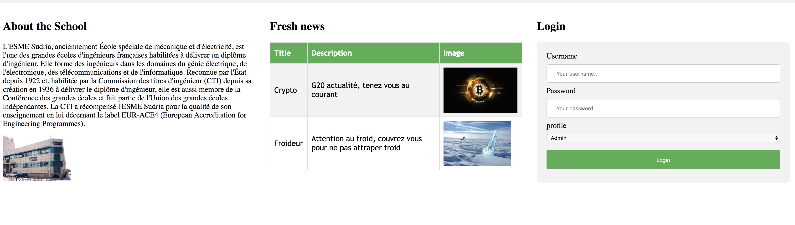
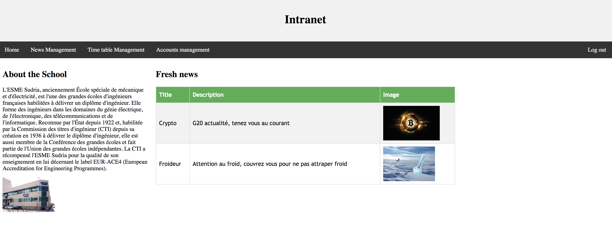
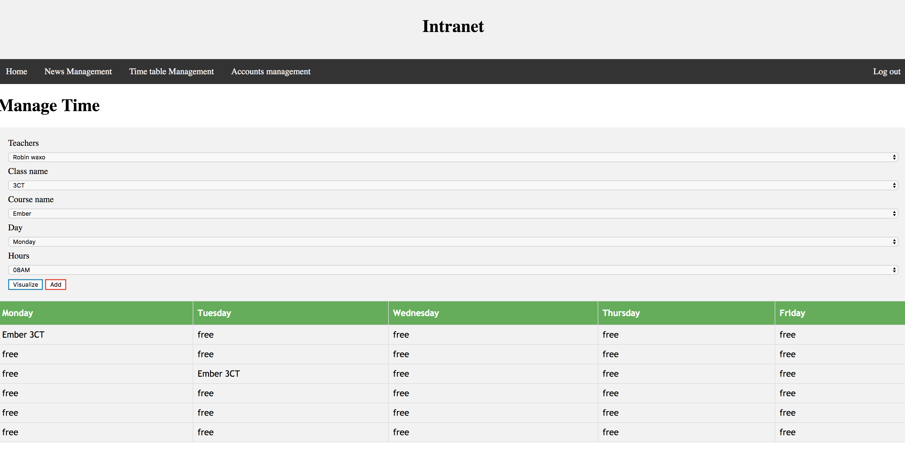
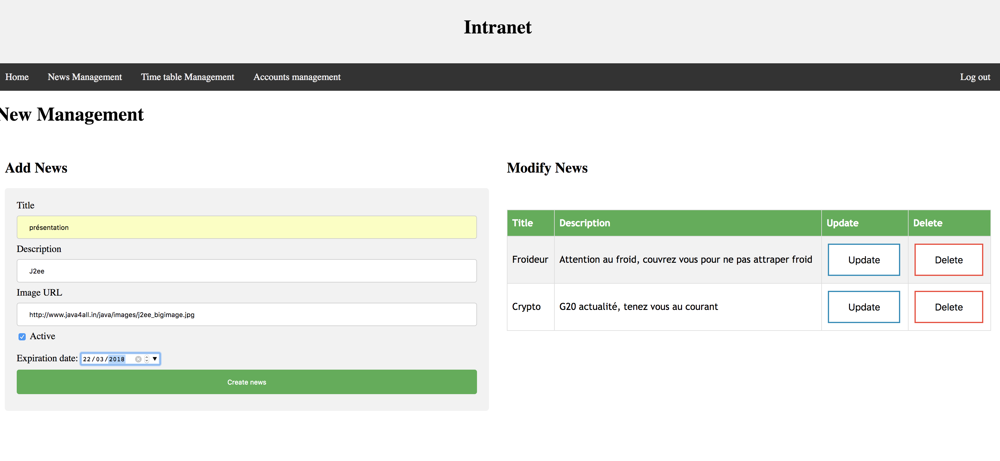
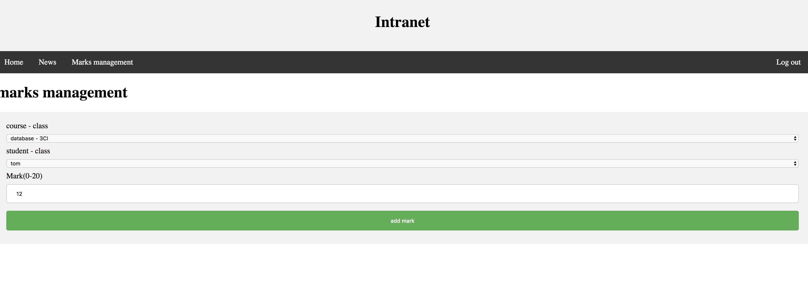

# Intranet Esme Sudria Project

This README outlines the details of collaborating on this J2EE application.
A short introduction of this app could easily go here.

## Prerequisites

You will need the following things properly installed on your computer.

* [eclipse](https://www.eclipse.org/)
* [spring Boot](https://docs.spring.io/spring-boot/docs/current-SNAPSHOT/reference/htmlsingle/#getting-started) 

## Installation

* `git clone https://github.com/chazzfit/ProjetJavaEE.git` 

## Running / Development
Just before starting, create your database :

* `CREATE DATABASE intranetPortal`
* change your creds mysql in application.properties
* Launch your server
* init data in database [http://localhost:8080/initDB](http://localhost:8080/createDB).
* Visit your app at [http://localhost:8080](http://localhost:8080).

## Resultats
# Home Login

# Home Admin

# Time table  admin managing

# News admin managing

# Mark teacher managing

# Time table student viewing

